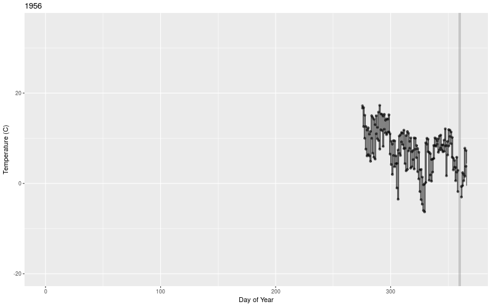
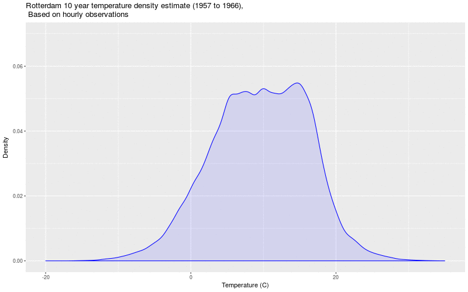

**[TL;DR](https://en.wikipedia.org/wiki/TL;DR) Explore temperature data and learn how to make plots like these using R:**
 
 

There's a lot of discussion about weather and climate change, but what seems to not get covered that much is what temperature data *actually* looks like.  Arguments about whether a cold wave disproves global warning or a heat wave is a sign of impending doom, really miss the point that the weather is a chaotic system, which is something that very clearly shows up in the data.

I'm not sure that focusing on a temperature increase of 2, 3, or 4 degrees is the best way to communicate what's going on.  There are a couple of reasons for this:

* If a day was a few degrees warmer than average, you probably wouldn't even notice it.  This actually happens all the time.
* Averages aren't necessarily that interesting, but outliers are.  Average days don't cause chaos, it's the extreme series of days such as heat waves which can really cause a strain on society.
* Averages do matter quite a bit if you're talking about if water will exist in a liquid or solid state.  In the Netherlands, the winter temperatures often hover around freezing, and a few degrees difference can lead to quite different outcomes.
* What ultimately matters is that we're pumping more energy into a complex global thermodynamic system, which may result in effects beyond what we expect.  We should keep in mind that hurricanes are basically just [giant heat engines](https://www.youtube.com/watch?v=1p-3YYYivIQ).

To explore what temperature data looks like in more detail, we start with [hourly temperature measurements](http://www.knmi.nl/nederland-nu/klimatologie/uurgegevens) for Rotterdam from KNMI with observations from 1956 until the present.  These are analyzed through a variety of various visualization techniques without any sophisticated statistics involved, and with most of the code slicing, sorting, and filtering the data in various ways.  What's shown is very close to the actual raw data.  

From a data analysis perspective, this code shows a lot of examples using the [dplyr](https://cran.rstudio.com/web/packages/dplyr/vignettes/introduction.html), [ggplot2](http://docs.ggplot2.org/current/) and [animation](https://cran.r-project.org/web/packages/animation/index.html) packages for R.  In particular I've found through this work that dplyr is really quite powerful for performing complex data operations all within code that is still quite readable.  The sections on calculating the Hellman Wintergetal and also looking at trends in how daily temperature records are broken demonstrate this quite well.

```{r, message=FALSE, warning=FALSE}
#never ever convert strings to factors
options(stringsAsFactors = FALSE)

library(dplyr)
library(ggplot2)
library(animation)

# data are contained in blocks per decade
files = c("uurgeg_344_1951-1960.zip", "uurgeg_344_1961-1970.zip", "uurgeg_344_1971-1980.zip", 
          "uurgeg_344_1981-1990.zip", "uurgeg_344_1991-2000.zip", "uurgeg_344_2001-2010.zip", 
          "uurgeg_344_2011-2020.zip")

downloadBaseURL = "http://cdn.knmi.nl/knmi/map/page/klimatologie/gegevens/uurgegevens/"

weather = NULL
for (file in files){
  
  textFile = gsub("\\.zip", ".txt", file)
  
  # if we don't have a zip file, download it from the KNMI website
  if (!file.exists(textFile)){
    download.file(paste0(downloadBaseURL, file), file)
    unzip(file)
  }
  
  df = read.table(textFile, sep=",", skip=49)
  weather = rbind(weather, df)
}

colnames(weather) = c("STN", "YYYYMMDD", "HH", "DD", "FH", "FF", "FX", "T", "T10", "TD", "SQ", 
                      "Q", "DR", "RH", "P", "VV", "N", "U", "WW", "IX", "M", "R", "S", "O", "Y")

# The temperature recorded in the data is actually the temperature * 10
weather$T = weather$T/10

# Add a few columns to make grouping by various parts of the date easier
weather$YYYYMMDD = as.character(weather$YYYYMMDD)
weather$Date = as.Date(weather$YYYYMMDD, format="%Y%m%d")

weather$Year = as.numeric(format(weather$Date, "%Y")) 
weather$DayOfYear = as.numeric(format(weather$Date, "%j"))
weather$MonthOfYear = as.numeric(format(weather$Date, "%m"))
weather$Decade = floor(weather$Year/10) * 10 # create a number indicating which decade the data is in
weather$MonthName = factor(month.name[weather$MonthOfYear], levels=month.name)
```

If we plot a simple line graph this isn't so insightful yet, although from this we can see that there's quite a lot of variation between the different years
```{r RotterdamHourlyDataOnePlot, warning=FALSE, cache=TRUE, fig.width=14, fig.height=10}
ggplot(weather, aes(x=Date, y=T)) + geom_line() + 
  ylab("Temperature (C)") + xlab("Date") + 
  ggtitle("Rotterdam Temperatures")
```

If we facet the plot per year, we can also see a bit more variability between the years.  From this we can already start to see some of the heat waves and cold spells.
```{r RotterdamHourlyDataFacetPerYear, warning=FALSE, cache=TRUE, fig.width=14, fig.height=10}
ggplot(weather, aes(x=DayOfYear, y=T)) + geom_line() + 
  ylab("Temperature (C)") + xlab("Day of Year") + 
  ggtitle("Rotterdam Temperatures") + 
  facet_wrap(~Year)
```

Overlaying the data as a scatter plot with transparency gives us an idea of the range of expected values and how distributed the extreme temperatures are.  

```{r RotterdamHourlyDataSinglePlotAllPoints, warning=FALSE, cache=TRUE, fig.width=14, fig.height=10}
ggplot(weather, aes(x=DayOfYear, y=T)) + geom_point(alpha=0.01) + 
  xlab("Day of Year") + ylab("Temperature (C)") + 
  ggtitle("Scatterplot of Hourly Temperatures, per Day")
```

A box plot per month basically confirms this.  Temperatures are generally within a narrow range, but there are quite a lot of outliers.
```{r RotterdamHourlyDataBoxPlotPerMonth, warning=FALSE, cache=TRUE, fig.width=14, fig.height=10}
ggplot(weather, aes(x=MonthOfYear, y=T, group=MonthOfYear)) + geom_boxplot() + 
  xlab("Month") + ylab("Temperature (C)") + ggtitle("Rotterdam Temperatures")
```

If we look at the min, max, and average temperatures per year, we can start to see a bit of warming trend, although with plenty off noise.
```{r MinMaxMeanPerYear, warning=FALSE, cache=TRUE, fig.width=8, fig.height=6}
startYear = min(weather$Year) + 1
finalYear = max(weather$Year) - 1

tempSummaryPerYear = weather %>% 
  filter() %>% 
  group_by(Year) %>% 
  summarize(maxTemp = max(T, na.rm=TRUE), 
            minTemp = min(T, na.rm=TRUE), 
            meanTemp = mean(T, na.rm=TRUE))

ggplot() + geom_line(data=tempSummaryPerYear, aes(x=Year, y=maxTemp)) + 
  geom_line(data=tempSummaryPerYear, aes(x=Year, y=minTemp)) + 
  geom_line(data=tempSummaryPerYear, aes(x=Year, y=meanTemp)) + ylab("Temperature (C)")
```


For an interesting visualization technique, we can use a [violin plot](https://en.wikipedia.org/wiki/Violin_plot).  This technique creates a [Kernel Density Estimate](https://en.wikipedia.org/wiki/Kernel_density_estimation) of the temperature values per year.  In more simplistic terms, you can think of this as being a sort of smoothed histogram.  The width of each violin gives an indication of the amount of the year which experiences those particular temperatures.  The horizontal lines correspond to 0 and 30 degrees Celsius, in order to give reference to what most people would consider hot and cold temperatures.

What really jumps out from this visualization are the years when the [Elfstedentocht](https://en.wikipedia.org/wiki/Elfstedentocht) was held.  This is a 200 kilometer ice skating race in the north of the Netherlands, and the limiting factor for the race is that it has to be a very cold winter for all of the canals and other waterways to freeze over enough.  The last one was 18 years ago in 1997, although in 2012 the [conditions were almost good enough](https://en.wikipedia.org/wiki/Elfstedentocht#Elfstedentocht_2012_-_the_race_that_did_not_happen).

Just from this visualization, we can see that different years have quite different shapes.  The extreme temperatures (which people tend to remember) usually last just a short time, although we can also see years such as 2010 where a huge amount of the time was actually below freezing.

```{r RotterdamHourlyDataViolinPlotPerYear, warning=FALSE, cache=TRUE, fig.width=14, fig.height=14}
ggplot(weather, aes(x=DayOfYear, y=T)) + geom_violin() + facet_wrap(~Year) + 
  geom_hline(yintercept=0) + 
  geom_hline(yintercept=30)
```

We can also try to measure something called the [Hellman Wintergetal](https://nl.wikipedia.org/wiki/Koudegetal) (in Dutch) which is used as a measure of the severity of winters.  The main idea with the measure is that over the course of the winter, we find days with average temperatures below zero and then sum up the absolute values of those averages.

As an example, if you have consecutive days with the following average temperatures:
```
c(-3.2, 2.1, -4.5)
```
Then the wintergetal would just take:
```
sum(abs(c(-3.2, -4.5)))
```
As we can see from [winterplaza.nl](http://www.winterplaza.nl/hellmann/), the strength of winters is characterized by the following ranges of point scores:

Classification | Points
---------------|-------
Strong | > 300 points
Very cold | > 160 points
Cold | > 100 points
Normal | 40-100 points
Gentle | < 40 points
Very gentle | < 20 points
Extremely gentle | < 10 points

```{r WinterGetal, warning=FALSE, cache=TRUE, fig.width=14, fig.height=10, message=FALSE}
# The WinterYear is the first year of the winter, 
# i.e. WinterYear 1956 represents the time frame November 1, 1956 -> March 31, 1957
# this helps for grouping the data later

hellman = weather %>% 
  filter(DayOfYear %in% c(c(305:365), c(1:90))) %>%  # dates considered are from 1 Nov until 31 March
  group_by(Date, DayOfYear, Year) %>%
  summarize(avgTemp = mean(T)) %>% 
  filter(avgTemp < 0) %>%
  mutate(WinterYear = Year - (1 - floor(DayOfYear/(366/2)))) %>% 
  arrange(Date) %>% 
  group_by(WinterYear) %>%
  mutate(HellmanWintergetal = cumsum(abs(avgTemp)), 
         DayOfWinter = (DayOfYear + (1 - floor(DayOfYear/(366/2))) * 365) - 305)

ggplot(hellman, aes(x=DayOfWinter, y=HellmanWintergetal, group=WinterYear)) + 
  geom_line() + 
  xlab("Day of Winter") + 
  ylab("Hellman Wintergetal") + 
  facet_wrap(~WinterYear)
```

The image above shows the progression of each year's score on the Hellman Wintergetal.  It's quite clear from this something truly epic happened in 1962, and indeed this was [the coldest winter since 1789](https://nl.wikipedia.org/wiki/Winter_van_1962-1963) in the Netherlands.

Ultimately, the winters are classified on their final scores which we can see below:

```{r HellmanWintergetalSummaryPerYear, warning=FALSE, cache=TRUE, fig.width=12, fig.height=8}
hellmanYearlySummary = hellman %>% 
  group_by(WinterYear) %>% 
  summarize(maxHellmanWinterGetal = max(HellmanWintergetal))

hellmanClasses = data.frame(className = c("Strong", "Very cold", "Cold", "Normal", 
                                          "Gentle", "Very Gentle", "Extremely Gentle"),
                            xmin = rep(min(hellmanYearlySummary$WinterYear)-1, 7),
                            xmax = rep(max(hellmanYearlySummary$WinterYear)+13, 7), 
                            ymin = c(300, 160, 100, 40, 20, 10, 0),
                            ymax = c(350, 300, 160, 100, 40, 20, 10), 
                            meanYVal = c(325, 230, 130, 70, 30, 15, 5), 
                            fillColor = c("#4575b4", "#91bfdb", "#e0f3f8", "#ffffbf", 
                                          "#fee090", "#fc8d59", "#d73027"))
# colors from http://colorbrewer2.org/

ggplot() + 
  geom_rect(data=hellmanClasses,  
            aes(xmin=xmin, xmax=xmax, ymin=ymin, ymax=ymax), 
            fill=hellmanClasses$fillColor, alpha=0.5) + 
  geom_bar(data=hellmanYearlySummary, aes(x=WinterYear, y=maxHellmanWinterGetal), 
           stat="identity", fill="grey40") + 
  geom_text(data=hellmanClasses,  
            aes(label=className, x=max(hellmanYearlySummary$WinterYear)+1, 
                y=meanYVal, hjust=0)) + 
  xlab("Winter Year") + ylab("Hellman Wintergetal") + 
  ggtitle("Hellman Wintergetal for Rotterdam")

```

What's interesting to look at as well are the temperature records and how they have evolved over time.  For the analysis here, we just start with the first data from 1956 and assume no prior data.  

In looking at the record highs and low per day, one aspect we can examine is how long these records have stood.  If the climate is getting warmer, then we would not expect for high temperatures records to stand for very long, as they would be frequently replaced by newer higher temperatures.  With the low temperature records, we would expect to see the opposite, with older records facing less threat of being beaten by new records.

This is actually what we see here, although it's clear there is variability among the years, and even though record highs are more likely to be broken, we still may experience record lows as well, although not as frequently.

```{r HistogramOfHighLowTemperatureRecordAges, fig.width=10, fig.height=4, cache=TRUE}
# this should get the first date of the record due to default behaviour of which.min and which.max
recordLowsAllYears = weather %>% 
  select(TRecord=T, RecordYear=Year, DayOfYear, MonthOfYear, MonthName) %>% 
  group_by(DayOfYear) %>% 
  arrange(DayOfYear, RecordYear) %>% 
  slice(which.min(TRecord)) %>% 
  mutate(TempRecordAge = 2015 - RecordYear, 
         RecordType = "Low")

recordHighsAllYears = weather %>% 
  select(TRecord=T, RecordYear=Year, DayOfYear, MonthOfYear, MonthName) %>%
  group_by(DayOfYear) %>% 
  arrange(DayOfYear, RecordYear) %>% 
  slice(which.max(TRecord)) %>% 
  mutate(TempRecordAge = 2015 - RecordYear, 
         RecordType = "High")

# stack up both data frames into one
recordsAllYears = rbind(recordLowsAllYears, recordHighsAllYears)

ggplot(recordsAllYears, aes(x=TempRecordAge)) + 
  geom_histogram(colour = "darkgreen", fill = "white", binwidth=1) + 
  xlab("Years since Temperature Record was set") + 
  ylab("Number of Temperature Records") + 
  ggtitle("Number of Temperature Records by Age") + 
  facet_wrap(~RecordType)
```

If we facet these values per month, we can see a similar trend.  Particularly for June and July, we do see more recent high temperature records being set, and for the winters, an accumulative of old record lows can be seen.  

What is quite noticeable is that the summers have a more even distribution of the age of the records, while this is not the case for the winters.  It's as if every summer has an even chance of setting a high or low record, while for the winters, certain years break several records.  

```{r HistogramOfHighLowTemperatureRecordAgesPerMonth, fig.width=12, fig.height=6, cache=TRUE}
ggplot(recordsAllYears, aes(x=TempRecordAge)) + 
  geom_histogram(colour = "darkgreen", fill = "white", binwidth=1) + 
  xlab("Years since Temperature Record was set") + 
  ylab("Number of Temperature Records") + 
  ggtitle("Number of Temperature Records by Age") + 
  facet_grid(RecordType ~ MonthName)
```

This next plot requires a bit more explanation and gives an indication for how often record low and high temperatures are broken. The idea is that we start with the first record high or low per day encountered in 1956 (or in 1957 as the 1956 data does not cover the whole year), and then for that same day of the year, we make a line that connects all other other times that we encountered new records on that day.  

```{r EvolutionOfHighAndLowRecordsSingleDayExample, cache=TRUE, fig.width=8, fig.height=4}
# day 295 has ten records listed
evolutionOfHighs = weather %>% 
  filter(DayOfYear == 295) %>% 
  select(Tmax=T, Year, DayOfYear, MonthOfYear) %>%
  group_by(DayOfYear, Year) %>% 
  slice(which.max(Tmax)) %>% 
  group_by(DayOfYear) %>% 
  arrange(Year) %>% 
  mutate(Tmax = cummax(Tmax)) %>% 
  group_by(DayOfYear, Tmax) %>% 
  filter(row_number()==1)

evolutionOfLows = weather %>% 
  filter(DayOfYear == 295) %>% 
  select(Tmin=T, Year, DayOfYear, MonthOfYear) %>%
  group_by(DayOfYear, Year) %>% 
  slice(which.min(Tmin)) %>% 
  group_by(DayOfYear) %>% 
  arrange(Year) %>% 
  mutate(Tmin = cummin(Tmin)) %>% 
  group_by(DayOfYear, Tmin) %>% 
  filter(row_number()==1)

ggplot() + 
  geom_line(data=evolutionOfHighs, aes(x=Year, Tmax)) + 
  geom_point(data=evolutionOfHighs, aes(x=Year, Tmax)) +
  geom_line(data=evolutionOfLows, aes(x=Year, Tmin)) + 
  geom_point(data=evolutionOfLows, aes(x=Year, Tmin)) + 
  xlab("Year") + ylab("Temperature (C)") + 
  ggtitle("Progression of Temperature Records for October 22")

```

The thing to keep in mind is that for the way the analysis is done below, **in the first year of the data, all the high temperatures observed per day are by definition "record" highs as we have no records before then**.  The next year, one would intuitively expect half of the temperatures to break records as well.  As time goes on, we would expect that fewer and fewer records are broken.  In other words, we would naturally expect big jumps on the left of the graph, and only on the right side is the breaking of a record a significant event.

Here we see how the records have changed over time, starting with the actual first recorded high/low values.

```{r EvolutionOfHighAndLowRecords, cache=TRUE, fig.width=12, fig.height=12}
# want to show the evolution of the records
# find the first record per day, and then locate all the records on that day which are higher (or lower)

# get the max per day, then sort by year
evolutionOfHighs = weather %>% 
  select(Tmax=T, Year, DayOfYear, MonthOfYear, MonthName) %>%
  group_by(DayOfYear, Year) %>% 
  slice(which.max(Tmax)) %>% 
  group_by(DayOfYear) %>% 
  arrange(Year) %>% 
  mutate(Tmax = cummax(Tmax)) %>% 
  group_by(DayOfYear, Tmax) %>% 
  filter(row_number()==1)

evolutionOfLows = weather %>% 
  select(Tmin=T, Year, DayOfYear, MonthOfYear, MonthName) %>%
  group_by(DayOfYear, Year) %>% 
  slice(which.min(Tmin)) %>% 
  group_by(DayOfYear) %>% 
  arrange(Year) %>% 
  mutate(Tmin = cummin(Tmin)) %>% 
  group_by(DayOfYear, Tmin) %>% 
  filter(row_number()==1)

ggplot() + 
  geom_line(data=evolutionOfHighs, aes(Year, Tmax, group=DayOfYear), alpha=0.1) +
  geom_point(data=evolutionOfHighs, aes(Year, Tmax, group=DayOfYear), alpha=0.1) + 
  geom_line(data=evolutionOfLows, aes(Year, Tmin, group=DayOfYear), alpha=0.1) + 
  geom_point(data=evolutionOfLows, aes(Year, Tmin, group=DayOfYear), alpha=0.1) + 
  xlab("Date") + ylab("Temperature (C)") + ggtitle("Progression of Daily Temperature Records") + 
  facet_wrap(~MonthName)
```

Another way in which temperature trends could be summarized is by creating a Kernel Density Estimate (KDE) of all the temperatures we encounter over a sliding window of dates.  As shown by the [Wikipedia article](https://en.wikipedia.org/wiki/Kernel_density_estimation), a KDE is roughly equivalent to a histogram, except instead of counting observations, we create a "kernel" with a normal distribution at the location of each observation, and then sum up all the kernels.  The result is a sort of smoothed histogram, with the added bonus that we can also use this as a probability distribution whose shape closely matches that of the original data.

```{r DecadalTemperatureDensity, warning=FALSE, cache=TRUE, message=FALSE}
startYear = min(weather$Year) + 1
finalYear = max(weather$Year) - 1
windowSizeInYears = 10
fileName = "RotterdamTemperatureDensity10Years.gif"
endYear = startYear + windowSizeInYears - 1 

# hold semi-transparent versions of the previous density plots so we can show them in the background
prevPlots = c() 

saveGIF({  
  while(endYear <= finalYear){
    
    if (startYear == endYear){
      titleText = paste0("Rotterdam ", windowSizeInYears, " year temperature density estimate (", 
                         startYear, "), \n Based on hourly observations")
    } else {
      titleText = paste0("Rotterdam ", windowSizeInYears, " year temperature density estimate (", 
                         startYear, " to ", endYear, "), \n Based on hourly observations")
    }
    
    # should leave the old profiles behind in the transparency
    p = ggplot(weather %>% filter(Year %in% c(startYear:endYear)), 
               aes(x=T)) + 
      geom_density(fill="blue", colour="blue", alpha=0.1) + prevPlots + 
      xlim(c(-20, 35)) + ylim(c(0,0.07)) + 
      ggtitle(titleText) + 
      xlab("Temperature (C)") + 
      ylab("Density")
    
    prevPlots = c(prevPlots, 
                  geom_line(data=weather %>% filter(Year %in% c(startYear:endYear)), 
                            aes(x=T), stat="density", alpha=0.2))
    print(p)
    
    startYear = startYear + 1
    endYear = endYear + 1
  }
}, interval = 0.1, movie.name = fileName, ani.width = 800, ani.height = 500)

```
 

As we know from the violin plots further above, there can be a lot of variation between the years, so taking a sliding window of 10 years tends to average a lot of this out in order to better show longer term trends.  From this we can see that the likelihood of freezing temperatures is decreasing, and that of higher temperatures is increasing, with the most frequent temperatures being in the range of 5 to 10 degrees Celsius.

The final plot is one famously highlighted in Edward Tufte's [Visual Display of Quantitative Information](http://www.edwardtufte.com/tufte/books_vdqi) and [on his blog](http://www.edwardtufte.com/bboard/q-and-a-fetch-msg?msg_id=00014g), which illustrates temperature trends over a year, while also highlighting averages and records.  The original graphic is from The New York Times, January 4, 2004, A15.  Of course [someone has figured out how to duplicate this in R](https://rpubs.com/bradleyboehmke/weather_graphic), and the code here borrows from that example, with a few modifications.  

```{r TuftePlot, warning=FALSE, cache=TRUE, fig.width=14, fig.height=10, warning=FALSE, message=FALSE}

# from this initial data frame, other data frames will be derived
dailyHighLowAllYears = weather %>% 
  group_by(Year, DayOfYear) %>% 
  summarize(dailyHigh = max(T), dailyLow = min(T))

years = sort(unique(weather$Year))
saveGIF({  
  for (year in years){
    
    # what are the daily highs and lows for this year?    
    dailyHighLowThisYear = dailyHighLowAllYears %>% 
      filter(Year == year)
    
    # what are the average highs and lows per day for all years up to and including this year?
    avgHighLowToPresentYear = dailyHighLowAllYears %>% 
      filter(Year <= year) %>% 
      group_by(DayOfYear) %>% 
      summarize(avgDailyHigh = mean(dailyHigh, na.rm=TRUE), 
                avgDailyLow = mean(dailyLow, na.rm=TRUE))
    
    # what are the absolute max and min temperatures per day up to and including this year?
    recordHighLowToPresentYear = dailyHighLowAllYears %>% 
      filter(Year <= year) %>% 
      group_by(DayOfYear) %>% 
      summarize(recordDailyHigh = max(dailyHigh, na.rm=TRUE), 
                recordDailyLow = min(dailyLow, na.rm=TRUE))
    
    mergedDailyAndAllTimeRecordsToPresentYear = merge(dailyHighLowThisYear, recordHighLowToPresentYear)
    highLocs = which(mergedDailyAndAllTimeRecordsToPresentYear$dailyHigh == 
                       mergedDailyAndAllTimeRecordsToPresentYear$recordDailyHigh)
    
    lowLocs = which(mergedDailyAndAllTimeRecordsToPresentYear$dailyLow == 
                      mergedDailyAndAllTimeRecordsToPresentYear$recordDailyLow)
    
    recordHighsBroken = mergedDailyAndAllTimeRecordsToPresentYear[highLocs, c("DayOfYear", "dailyHigh")]
    recordLowsBroken = mergedDailyAndAllTimeRecordsToPresentYear[lowLocs, c("DayOfYear", "dailyLow")]
    
    
    p = ggplot() + geom_rect(data=recordHighLowToPresentYear, 
                             aes(xmin=DayOfYear, xmax=DayOfYear+1, 
                                 ymin=recordDailyLow, ymax=recordDailyHigh), alpha=0.25) + 
      geom_step(data=avgHighLowToPresentYear, aes(x=DayOfYear, y=avgDailyHigh), alpha=0.75) + 
      geom_step(data=avgHighLowToPresentYear, aes(x=DayOfYear, y=avgDailyLow), alpha=0.75) + 
      geom_segment(data=dailyHighLowThisYear, 
                   aes(x=DayOfYear+0.5, xend=DayOfYear+0.5, 
                       y=dailyLow, yend=dailyHigh), 
                   alpha=0.25, size=1) + 
      geom_rect(data=avgHighLowToPresentYear, 
                aes(xmin=DayOfYear, xmax=DayOfYear+1, 
                    ymin=avgDailyLow, ymax=avgDailyHigh), alpha=0.25) + 
      geom_point(data=recordHighsBroken, aes(x=DayOfYear+0.5, y=dailyHigh), alpha=0.5) + 
      geom_point(data=recordLowsBroken, aes(x=DayOfYear+0.5, y=dailyLow), alpha=0.5) + 
      xlim(0,366) + ylim(-20, 35) + 
      ggtitle(year) + xlab("Day of Year") + ylab("Temperature (C)")
    
    print(p)
  }
}, interval = 0.1, movie.name = "RotterdamTufteAnimation.gif", ani.width = 800, ani.height = 500)

```

 

The visualization consists of three horizontal bands.  The narrow one centered around the middle highlights the average highs and lows for that day of the year.  The widest band shows the record highs and lows.  The chaotic looking band shows the actual highs and lows for that day during the year.  Dots indicates where records have been broken.

The animation shows how averages and records get refined over time.  At the beginning, we don't have any historical data, so every observational is a record.  As we get more samples each year, the characteristic shape of the actual expected temperature trends starts to emerge.

